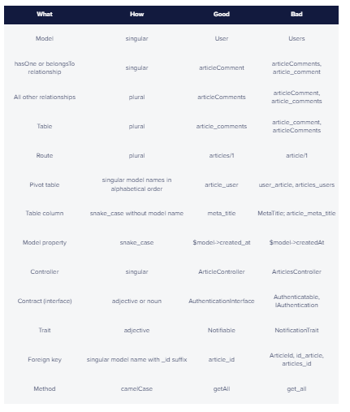

## Laravel Best Practice
Reference [link](https://buttercms.com/blog/laravel-best-practices/)

## Log Format

Reference [link](developers.google.com/apps-script/guides/web)

```
use Illuminate\Support\Facades\Log;

Log::info('[NameFunction].[NameClasses] [ProcessName]: '. [array urgent information]);

Example
Log::info('GetCurrency.FinanceController Get Currency: '. ["request" => $request, etc]);
```

## Add Feature Test

Each new feature please add new feature test

## PR Rules

Complete PR Template and Add @afifhrz as the reviewer

## Maintain Laravel naming conventions
PSR Standard - https://www.php-fig.org/psr/psr-2/

